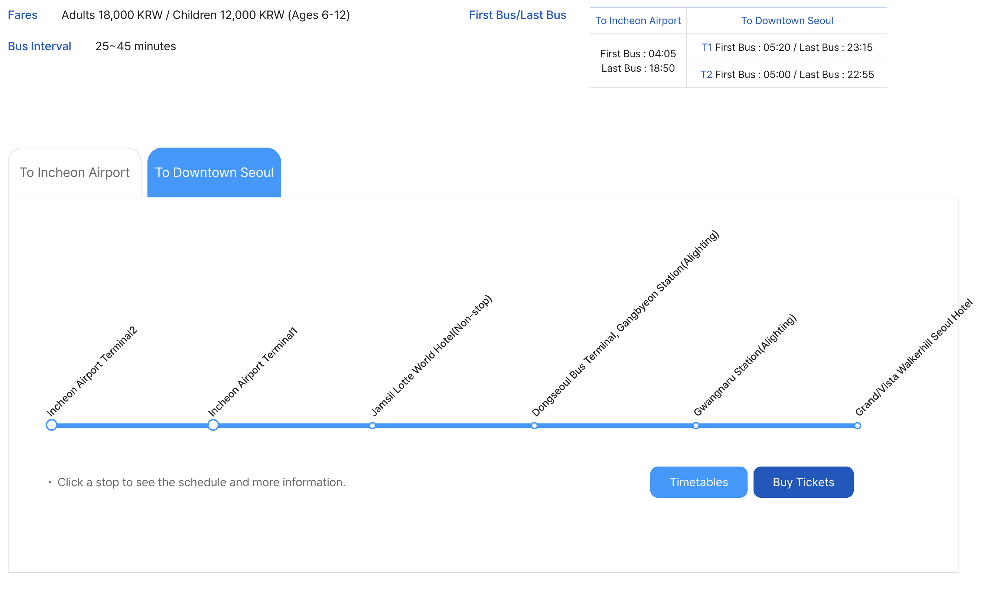

# South Korea Travel Information 2025

## Key Locations

| Place | Address |
|-------|---------|
| Hotel | LOTTE HOTEL WORLD, 240 Olympic-ro, Songpa District, Seoul |
| Office | 708-4 Yeoksam-dong, Gangnam District, Seoul |

**Directions:**
- [Incheon Airport → Hotel (Google Maps)](https://www.google.com/maps/dir/Incheon+International+Airport/Lotte+Hotel+World,+240+Olympic-ro,+Songpa-gu,+Seoul)
- [Hotel → Office (Google Maps)](https://www.google.com/maps/dir/Lotte+Hotel+World,+240+Olympic-ro,+Songpa-gu,+Seoul/708-4+Yeoksam-dong,+Gangnam-gu,+Seoul)

---

## Transportation to Lotte Hotel World

### From Incheon International Airport (ICN)

#### Option 1: Airport Limousine Bus (Line 6705A)

Direct and convenient - drops you off right at the hotel.

| Detail | Information |
|--------|-------------|
| **Terminal 1** | 1st floor, Bus Stop 4 |
| **Terminal 2** | Transportation Center B1, Bus Stop 19 |
| **Fare** | ₩18,000–₩24,000 |
| **Travel Time** | ~75–90 minutes (depending on traffic) |
| **Frequency** | Every 20–30 minutes |

[Bus Schedule & Info](https://www.klimousine.com/EN/bus/limousine.php?bus_no=6705A#inner)

#### Option 2: Subway

Cheapest option, but requires a transfer.

1. Take **Airport Railroad Express (AREX)** from Incheon Airport → **Magongnaru Station**
2. Transfer to **Seoul Subway Line 9** → **Seokchon Station**
3. Short walk to hotel

| Detail | Information |
|--------|-------------|
| **Fare** | ~₩4,900–₩7,000 |
| **Travel Time** | ~1 hour 45 minutes |

#### Option 3: Taxi

Fastest door-to-door service.

| Detail | Information |
|--------|-------------|
| **Fare** | ~₩90,000–₩110,000 |
| **Travel Time** | ~60 minutes (depending on traffic) |

---

### From Gimpo International Airport (GMP)

#### Option 1: Subway (Recommended)

Most efficient and affordable route - no transfers needed.

1. Take **Seoul Subway Line 9** from Gimpo Airport Station → **Seokchon Station**

| Detail | Information |
|--------|-------------|
| **Fare** | ~₩1,900–₩2,200 |
| **Travel Time** | ~70 minutes |

#### Option 2: Taxi

Fastest option from Gimpo.

| Detail | Information |
|--------|-------------|
| **Fare** | ~₩45,000–₩55,000 |
| **Travel Time** | ~31 minutes (depending on traffic) |

---

## Entry Requirements (U.S. Passport Holders)

### What You Need

- **Valid U.S. Passport**
- **Visa**: Not required for stays ≤ 90 days (tourism/business)
- **K-ETA**: Not required for U.S. passport holders until **Dec 31, 2025** (optional, may speed up immigration)
- **e-Arrival Card**: Must be submitted **within 3 days before arrival**

### Before Arrival Checklist

- [ ] Submit **e-Arrival Card** online (recommended before boarding)
- [ ] (Optional) Apply for **K-ETA** for smoother immigration
- [ ] Review restricted items, especially medications or substances regulated in Korea

### Important Notes

- K-ETA exemption ends **Dec 31, 2025** — after that, K-ETA becomes required before boarding
- Immigration officers still make final entry decisions even with a K-ETA
- For **work, study, or long-term stay (>90 days)** → a proper visa **is required**

---

## Useful Links

- [K-ETA Application (for US Citizens)](https://apply.joinsherpa.com/visa/south-korea/american-citizens?language=en-US)
- [US Embassy Travel Advisory - South Korea](https://travel.state.gov/en/international-travel/travel-advisories/south-korea.html)
- [Airport Limousine Bus 6705A Schedule](https://www.klimousine.com/EN/bus/limousine.php?bus_no=6705A#inner)
