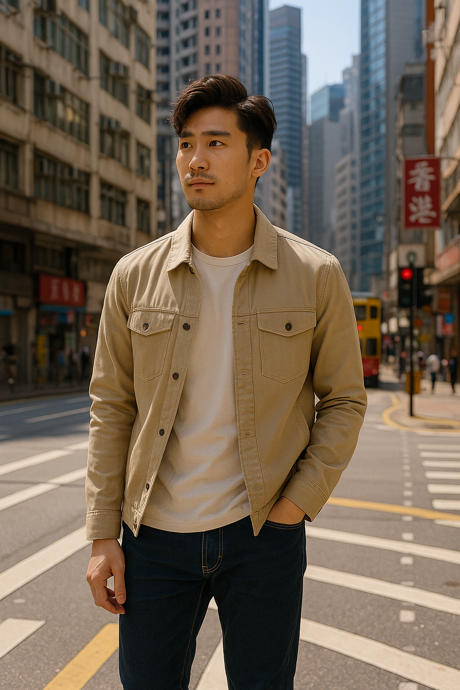
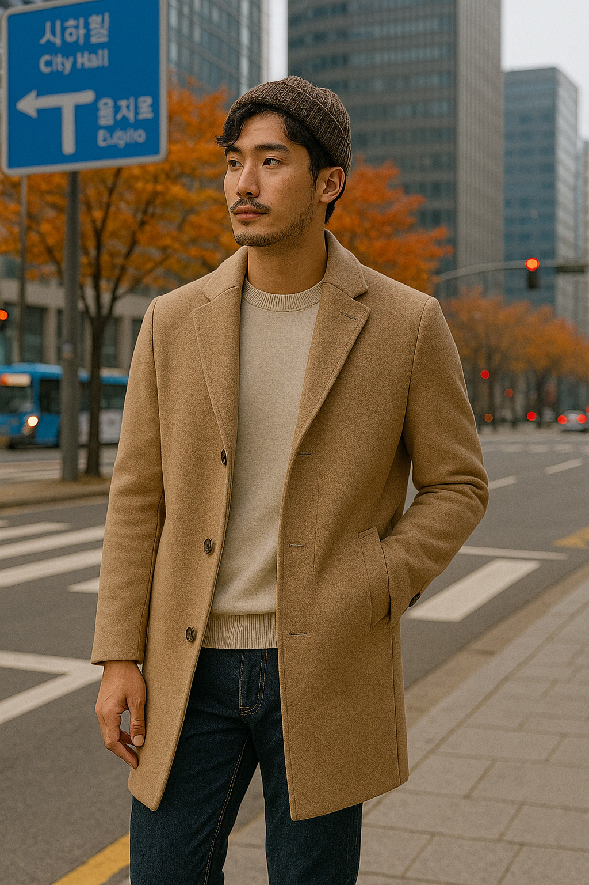
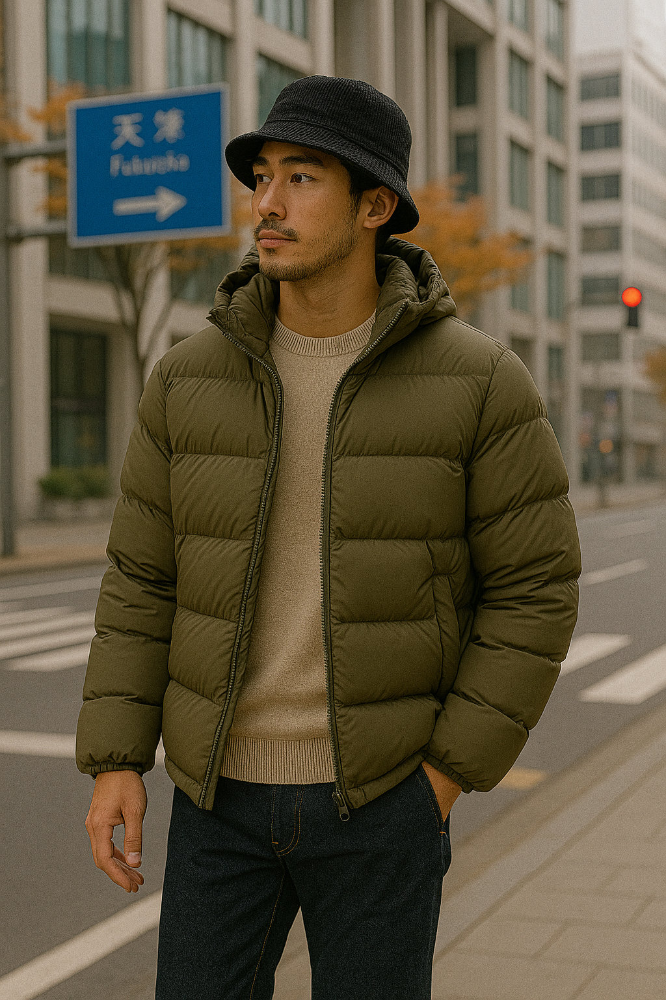

# 🧳 亞洲行衣物及行李指南（2025年11月16日至12月5日）

**行程地點：**
1. 香港 — 2025年11月16日至22日  
2. 首爾 — 2025年11月23日至29日  
3. 釜山 — 2025年11月29日至12月1日  
4. 福岡 — 2025年12月2日至5日

---

## 🌤 天氣概覽

| 城市 | 日期 | 平均最高 / 最低氣溫 (°C) | 備註 |
|------|------|-----------------------------|------|
| **香港** | 11/16 – 11/22 | 24 / 19 | 日間溫暖、夜晚涼快，乾爽舒適。 |
| **首爾** | 11/23 – 11/29 | 12 / 3 | 初冬氣候，早晚寒冷，微風。 |
| **釜山** | 11/29 – 12/1 | 15 / 7 | 比首爾溫和一點，海邊風大。 |
| **福岡** | 12/2 – 12/5 | 13 / 5 | 進入冬季，早晚偏冷，需穿外套。 |

**小貼士：**  
行程由暖轉冷，建議採用「層次穿搭法」，逐層加衣而非多帶衣物。

---

## 👗 穿搭圖片參考（Outfit Image Gallery）

| 香港 | 首爾 | 福岡 |
|:----:|:----:|:----:|
|  |  |  |
| *輕便層次感穿搭：T 恤＋薄外套* | *秋冬韓系造型：針織＋羊毛外套* | *日系冬季穿搭：羽絨＋圍巾＋毛衣* |

---

## 👕 應帶衣物建議

### **基本款（適用所有地點）**
- 內衣褲、襪（可多帶幾對）  
- 舒適步行鞋  
- 牛仔褲或長褲  
- 休閒長褲或卡其褲  
- T 恤或薄長袖上衣（2–3件）  
- 一套較正式的服裝（晚餐／活動用）  
- 配件：太陽眼鏡、小背囊或日用包  

### **保暖層及外套**
- 輕薄毛衣或抓絨衣 × 2  
- 長袖上衣或 henley 衫 × 2  
- 厚毛衣 / 羊毛衫 × 1  
- 中厚外套（首爾／釜山適用） × 1  
- 厚外套或羽絨外套（福岡必備） × 1  
- 圍巾、手套、冷帽（從首爾開始可使用）  
- 保暖底層衣（可選，福岡夜間用）  
- 輕便防水外套 / 雨褸 × 1  

### **城市穿搭重點**
- **香港：** 天氣溫和，T 恤＋薄外套已足夠。  
- **首爾 / 釜山：** 長袖＋毛衣＋外套，建議加圍巾。  
- **福岡：** 最寒冷一站，需厚外套、圍巾、手套。  
- **鞋類：** 一雙舒適步行鞋 + 一雙較好看的鞋作晚餐用途。

---

## 🧾 詳細行李清單

| 類別 | 品項 | 數量 | 備註／使用時機 |
|------|------|------|----------------|
| **上衣層次** | 短袖 T 恤 | 3–4 | 香港日間穿／其他城市作底層 |
|  | 長袖上衣／henley 衫 | 2 | 首爾、釜山、福岡 |
|  | 輕薄毛衣／抓絨衣 | 2 | 保暖中層 |
|  | 厚毛衣／羊毛衫 | 1 | 福岡夜間使用 |
|  | 襯衫／較正式上衣 | 1 | 晚餐或活動場合 |
| **外套** | 中厚外套 | 1 | 首爾、釜山使用 |
|  | 厚外套／羽絨 | 1 | 福岡（約5°C 夜間） |
|  | 輕便防水外套／雨褸 | 1 | 濕潤或下雨天備用 |
| **下身衣物** | 牛仔褲 | 1–2 | 全程適用 |
|  | 卡其褲／休閒長褲 | 1 | 晚餐或較暖天氣 |
|  | 輕薄長褲／運動褲 | 1 | 飛行或香港天氣使用 |
|  | 保暖褲（可選） | 1 | 福岡夜間保暖用 |
| **內著與睡衣** | 內衣褲 | 7–8 | 可中途洗 |
|  | 襪子 | 7–8 | 含1–2對厚襪 |
|  | 睡衣／家居服 | 1 | 棉質或絨料皆可 |
| **鞋類** | 步行鞋／運動鞋 | 1 | 主要鞋款 |
|  | 正裝鞋／皮鞋 | 1 | 可選 |
|  | 室內拖鞋 | 1 | 韓國／日本住宿常用 |
| **配件** | 圍巾 | 1 | 首爾以後使用 |
|  | 手套 | 1 | 釜山／福岡 |
|  | 冷帽 | 1 | 福岡夜間或戶外 |
|  | 太陽眼鏡 | 1 | 香港日間 |
|  | 小背囊／日用包 | 1 | 每日外出使用 |
|  | 摺疊雨傘 | 1 | 隨身備用 |
| **個人用品** | 牙刷、牙膏、護膚品等 | — | 符合手提行李規格 |
| **其他** | 旅行插頭 (Type G／C／F) | 1 | 香港=G；韓國／日本=C/F |
|  | 可重用水樽 | 1 | 觀光時方便補水 |
|  | 藥物／維他命 | — | 帶足整個行程所需 |
|  | 證件、信用卡、現金 | — | 保持隨身 |

---

## 🗓 各地穿搭建議

| 地點 | 平均氣溫 (°C) | 穿搭建議 |
|------|---------------|-----------|
| **香港 (11/16–22)** | 19 – 25 | T 恤 + 薄外套 + 牛仔褲 |
| **首爾 (11/23–29)** | 5 – 12 | 長袖 + 毛衣 + 外套 + 圍巾 |
| **釜山 (11/29–12/1)** | 7 – 14 | 長袖 + 抓絨 + 外套 + 手套（夜晚） |
| **福岡 (12/2–5)** | 5 – 11 | 毛衣 + 厚外套 + 圍巾 + 保暖底層 |

---

## ✈️ 打包小貼士

- **層次穿搭：** 行程愈往後愈冷，靠加層取暖，減少行李。  
- **中途洗衣：** 建議在首爾或釜山洗一次。  
- **壓縮袋／分隔袋：** 節省空間、保持整齊。  
- **顏色搭配：** 黑、灰、藍、米色等中性色方便混搭。  
- **留空間購物：** 韓國、日本時裝店值得血拼。  
- **出發前查天氣：** 出發前再看當地預報調整衣物。  
- **注意晚間氣溫：** 沿海地區（釜山、福岡）夜晚更冷。

---

✅ **總結**
- 氣溫由約 25°C → 5°C，逐步轉冷。  
- 建議攜帶：厚外套 ×1、中厚外套 ×1、毛衣 ×2、長袖上衣 ×2。  
- 圍巾、手套、冷帽可靈活調整保暖度。  
- 以一套可層疊組合的衣物應付全程氣候。

---

**檔案名稱：** `AsiaTrip_Clothing_Checklist_2025_TC.md`  
**作者：** Arthur F.（2025年11–12月行程規劃）
